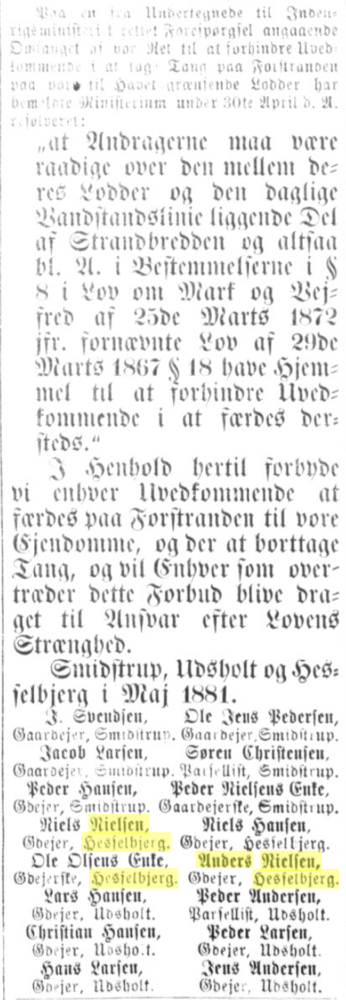
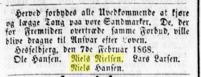

### Sagernes baggrund og berettigelse

 

- Tang var væsentligt dengang
 
 
- En reel konflikt om ejendoms/adgangsret imod gammel sædvane
  - mellem Hesselbjergs 4 gårdmænd og nogle omkringboende
- Parterne er enige om forløbet: alle vedstår at have taget tang
- Afgørelserne går skiftevis for og imod parterne
- Alle sagsomkostninger afholdes af det offentlige 
- Kongen giver dispensation til appel
 
 
- Lodsejerne har indrykket forbuds-bekendtgørelser i avisen
- Ændring i lov om vej- markfred i 1872

 
 

