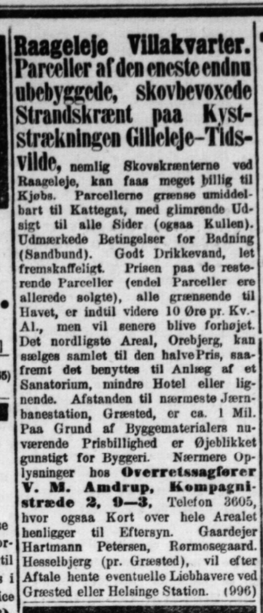

## Valdemar Michael Amdrup, 1860-1936

 

- Opvokset indre Frederiksberg
- Student, Jurist, 1888: Overretssagfører
- 1890: Borgerligt gift med lærerinde Mathilde Caroline Koefoed
 
 
- 1901: Køber hele matr. 12c af Hesselbjergs overdrev
- 1909: Juridisk Direktør for Den sjællandske Bondestands Sparekasse
- Med-grundlægger og medl. af best. for (Danmarks) Naturfredningsforening
 
 
- Flytter fra Kompagnistræde til [Ny Vestergade](https://maps.app.goo.gl/pAy49DHqsED8EUVK9)
- 1926: Testamenterer Åkandesøen og et område vest for til offentlig park
- 1960'erne: lægger navn til V. M. Amdrups Vej i Hesselbjerg

  